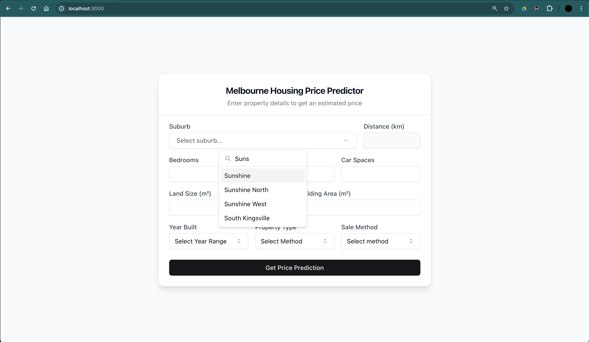
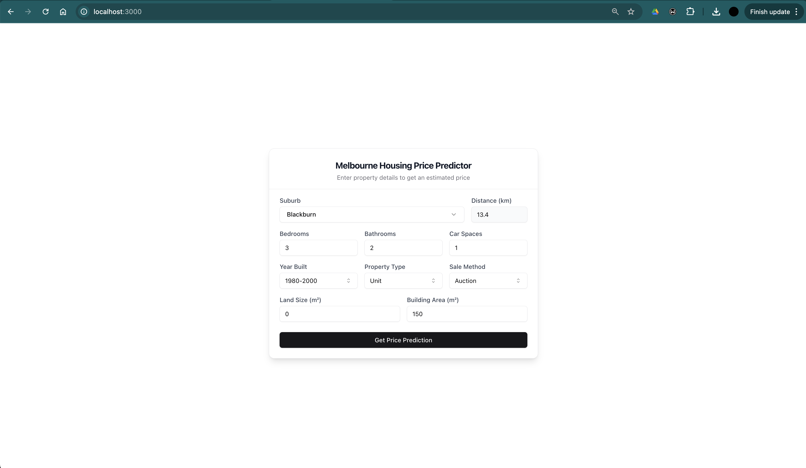
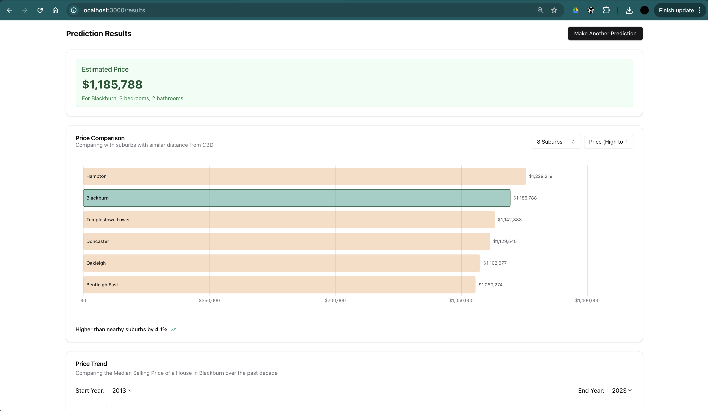
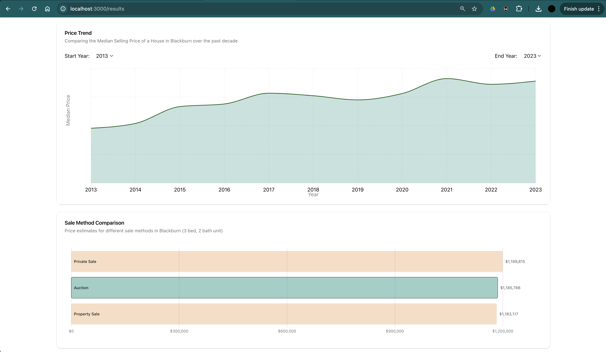

# HomeWorth-Melbourne 🏠📊💰🌆

A full-stack application designed to predict house prices in Melbourne based on various property features. The project includes a machine learning backend powered by FastAPI and a modern, interactive frontend built with Next.js and ShadCN UI components. Users can enter details about a property, view predicted prices, and compare prices in nearby suburbs.

## Key Features

- **Property Price Prediction**: Using a machine learning model to provide accurate price predictions based on property features.
- **Comparison with Nearby Properties**: Visual comparison of predicted prices with similar properties in nearby suburbs, helping users make more informed decisions.
- **User-Friendly Interface**: Built with Next.js and ShadCN UI components for a smooth and interactive experience.
## Screenshots
### Input Form



### Result Page



## Project Structure

```
homeworth-melbourne/ 
├── backend/ # Backend (FastAPI, ML model, CORS)
├── frontend/ # Frontend (Next.js, ShadCN UI)
├── LICENSE # License information
└── README.md # Project documentation 
```
## Technologies Used

### Backend (FastAPI and Machine Learning)

- **FastAPI**: A high-performance web framework used to create the backend server, handling API requests and serving the machine learning model. FastAPI provides fast response times and automatic generation of OpenAPI documentation, making it ideal for machine learning APIs.
- **scikit-learn**: Used for data preprocessing, model training, and evaluation. The machine learning model is a `VotingRegressor`, combining linear regression, random forest, and gradient boosting for robust predictions.
- **joblib**: Utilized for saving and loading the trained model pipeline, allowing efficient model reuse without retraining.
- **CORS Middleware**: Configured in FastAPI to enable cross-origin requests from the Next.js frontend, allowing seamless communication between frontend and backend.

### Frontend (Next.js and ShadCN UI)

- **Next.js**: A powerful React-based framework providing server-side rendering, routing, and API integration. This enhances performance and SEO, making it suitable for dynamic applications like HomeWorth-Melbourne.
- **ShadCN UI Components**: A collection of customizable and accessible UI components, designed to create an attractive and responsive user interface.
- **Radix UI**: A set of accessible UI primitives (e.g., popovers, dialogs, and dropdowns) that enhance the frontend's interactivity and usability.
- **Recharts**: Used to visualize the predicted price in comparison to similar properties, making the data more accessible and engaging for users.
- **Tailwind CSS**: A utility-first CSS framework that enables fast and flexible styling directly within components, resulting in a clean and responsive UI.

## Functionalities

### Backend Functionality

The backend serves as the core engine for processing property data, predicting house prices, and enabling real-time comparisons.

1. **Data Preprocessing and Model Training**:
   - The backend uses a preprocessing pipeline with scikit-learn to handle missing values, perform feature scaling, and encode categorical variables.
   - A `VotingRegressor` model combines `LinearRegression`, `RandomForestRegressor`, and `GradientBoostingRegressor`, offering a balanced and reliable prediction.
   - The model is trained on a dataset of Melbourne housing prices, and the pipeline is saved as a `.joblib` file for efficient reuse.

2. **API Endpoints**:
   - `POST /predict`: Accepts property details as input and returns the predicted price.
   - `GET /health`: A health check endpoint to confirm the backend is running and accessible.

3. **CORS Configuration**:
   - Configured to allow requests from the frontend hosted on `http://localhost:3000`, enabling seamless integration between frontend and backend.

The backend functionality is designed to handle the core tasks of data processing and prediction efficiently, providing accurate and quick responses to frontend requests.

### Frontend Functionality

The frontend provides an intuitive interface for entering property details, viewing predictions, and comparing similar properties.

1. **Price Prediction Form** (`PricePredictorForm.tsx`):
   - Collects user inputs, including property attributes such as number of rooms, land size, property type, and other details.
   - Validates inputs to ensure accurate data entry and sends the information to the backend’s prediction endpoint.
   - Displays the predicted price in a user-friendly format.

2. **Price Comparison Chart** (`PriceComparisonChart.tsx`):
   - Visualizes the predicted price compared to similar properties in nearby suburbs.
   - Allows users to filter and sort properties by various attributes, such as price, suburb name, and proximity to the central business district.
   - Features a responsive bar chart using Recharts, providing users with a clear and insightful visual representation of property prices.

3. **Additional Features**:
   - **Suburb Autocomplete**: An autocomplete feature for suburb selection, which automatically fills in relevant data such as distance from the CBD and postcode for added convenience.
   - **Interactive Sorting and Filtering**: Users can adjust the display count and sorting order of the comparison chart, offering greater control over the displayed data and enhancing user experience.

This frontend setup ensures a smooth, interactive experience for users as they navigate property details and analyze house price predictions in Melbourne.

## License
This project is licensed under the MIT License.
